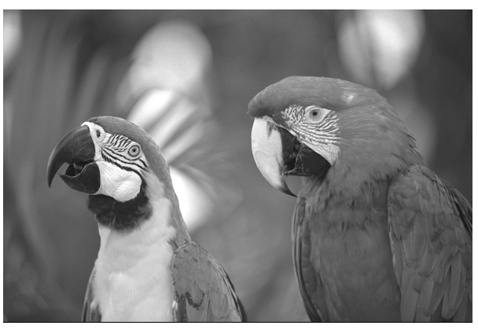
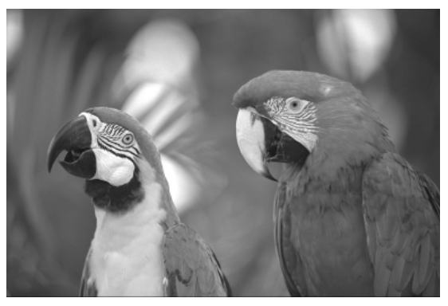
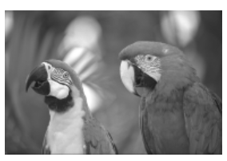
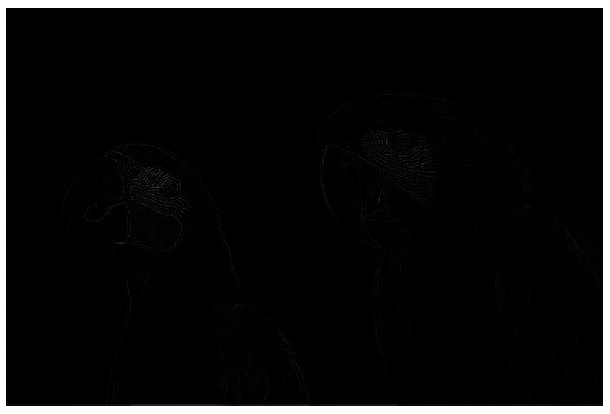
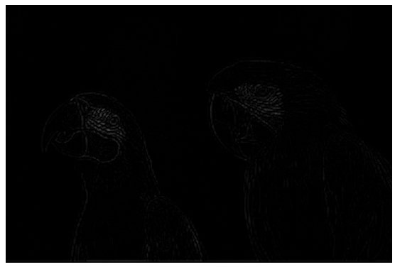
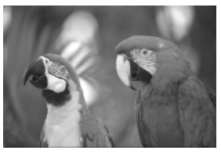
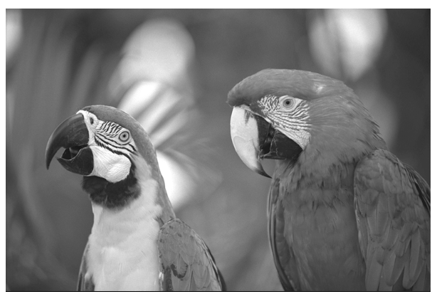
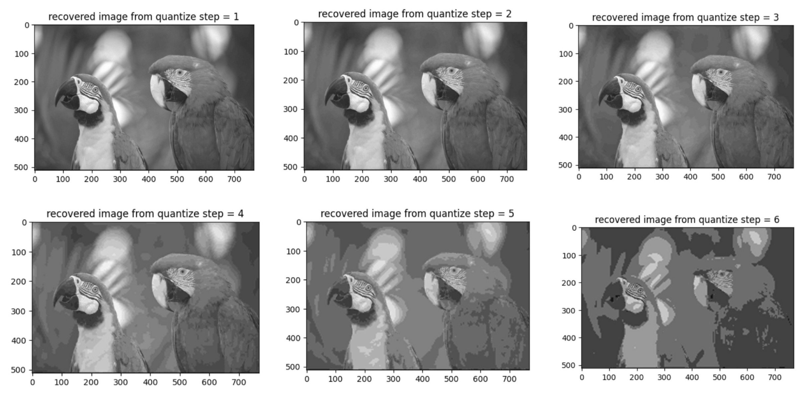
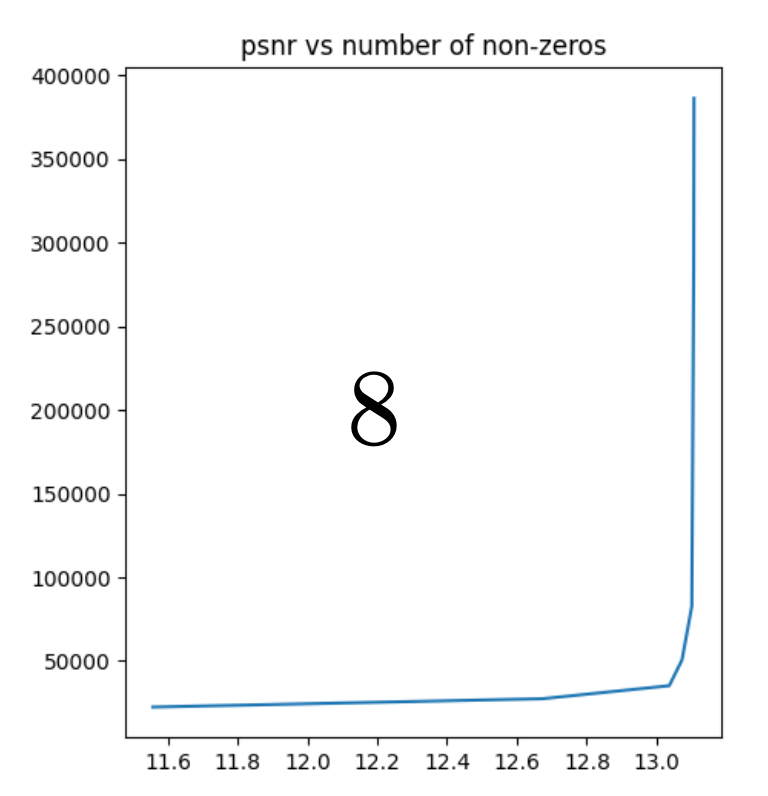

# Gaussian and Laplacian pyramids

This project involves constructing and analyzing Gaussian and Laplacian pyramids for image decomposition and reconstruction, as well as evaluating their efficiency through quantization. 

First, I implement functions to construct Gaussian and Laplacian Pyramids to decompose an input grayscale image into J-level pyramids. For doing so, we used cv2.resize with INTER_LINEAR for downsampling and INTER_CUBIC for upsampling.

We know that:

Gaussian Pyramid: Downscales the image progressively using Gaussian blurring, creating a pyramid where each level represents a lower resolution version of the original image.

Laplacian Pyramid: Created by subtracting each Gaussian level from its next finer level, resulting in a series of images that capture the detail lost at each downsampling stage.

Next, we developed a function to reconstruct the original image from a J-level Laplacian pyramid, and tested the reconstruction on a sample image to ensure the process accurately recreates the original image.
The results for both the Gaussian and Laplacian pyramids for J=3 are shown below:

**The Gaussian pyramid image for J = 3:**

**The Laplacian pyramid image for J = 3:**

**The reconstructed image from the Laplacian pyramid for J = 3:**

From our results, we see that as we increase the depth of the pyramid, we create a more detailed representation of the original image, which can improve the ability to capture more details in the image.
The desired reconstruction PSNR is a measure of the quality of the reconstructed image. 

Next, we write a function to quantize the coefficients of the Laplacian pyramid with a specified step-size q. The quantization formula adjusts coefficients based on their mean μ, with μ=0 for Laplacian images and μ=128 for Gaussian images. This process reduces the number of unique values, effectively compressing the pyramid. For pyramid levels J=0,1,2,3 (where J=0 is the original image), the PSNR (Peak Signal-to-Noise Ratio) was plotted against the number of non-zero coefficients after quantization at various step sizes q=2^n, n=0,1,…,8. 

For J=3 we have the following:

For Quantization, the point at which it becomes unnoticeable is the point where the reconstructed image closely resembles the original image. At this point, the number of non-zero coefficients is significantly reduced compared to the original image. By comparing the reconstructed image with the original image, at a quantization level of Q = 3, we notice that the difference between the reconstructed image and the original image becomes insignificant, and this is the point at which quantization is unnoticeable.

